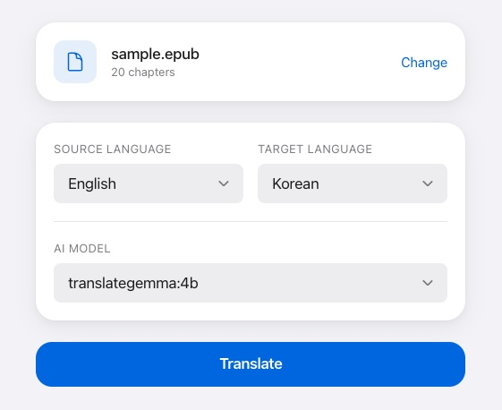

# EPUB Translator

A Web UI for translating EPUB files using local Ollama models. Keep your privacy intact and translate without API costs.



## Features

- **Multi-language Translation**: Support for 10+ languages including English, Korean, Japanese, and Chinese
- **Local Ollama Integration**: Use any Ollama model installed on your machine
- **Real-time Progress**: WebSocket-based live translation progress updates
- **EPUB Structure Preservation**: Maintains original chapters, styles, and images
- **Simple Web UI**: Drag and drop interface for easy file upload

## Prerequisites

- Python 3.11+
- Node.js 18+
- Ollama (installed and running locally)
- Translation model: `translategemma:4b` (recommended)
- uv (Python package manager)

## Installation

### Ollama setup

```bash
# Install Ollama
curl -fsSL https://ollama.com/install.sh | sh

# Install translation model in local
ollama pull translategemma:4b
```

### Epub Translator

```bash
bash ./install.sh
```

## Running

Start both backend and frontend (recommended)
```bash
bash ./start.sh
```

Or run separately
```bash
# Backend
cd backend && source .venv/bin/activate && uvicorn app.main:app --reload

# Frontend (in a new terminal)
cd frontend && npm run dev
```

## Access

- **Web UI**: http://localhost:5173
- **API Docs**: http://localhost:8000/docs

## License

MIT

See [doc.md](doc.md) for detailed documentation.
